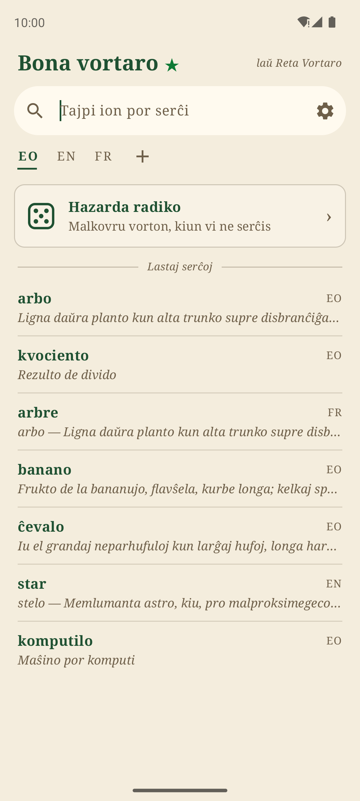
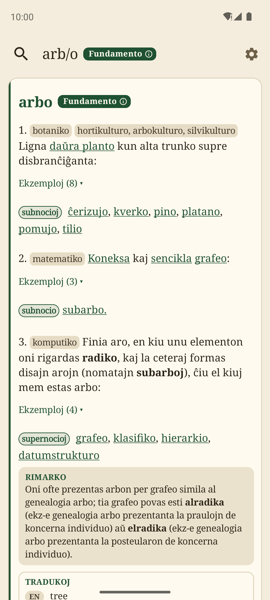
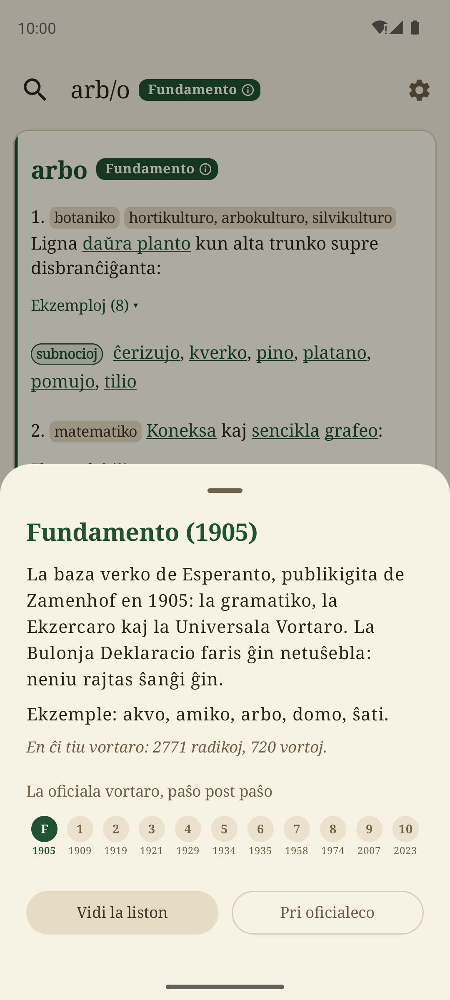
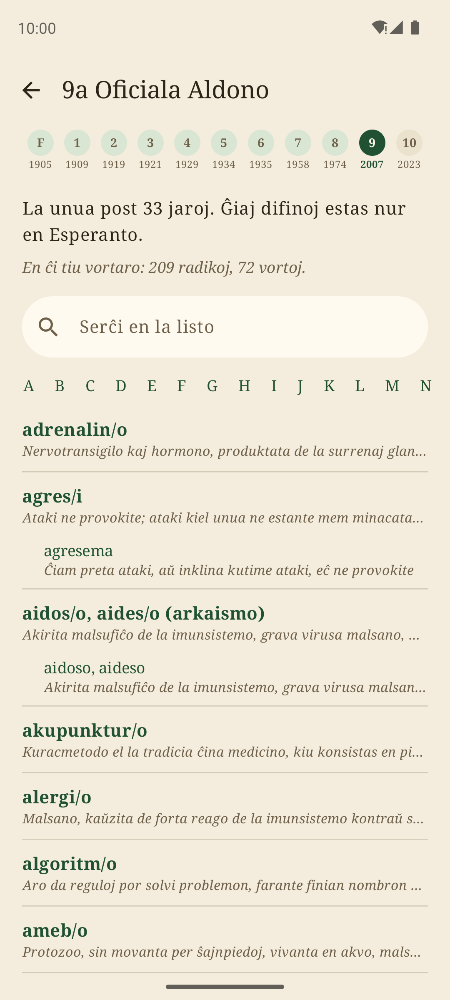
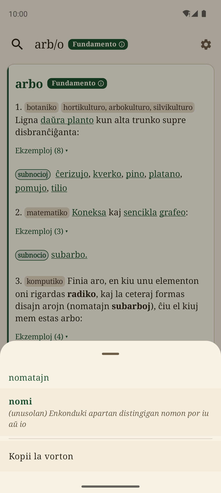
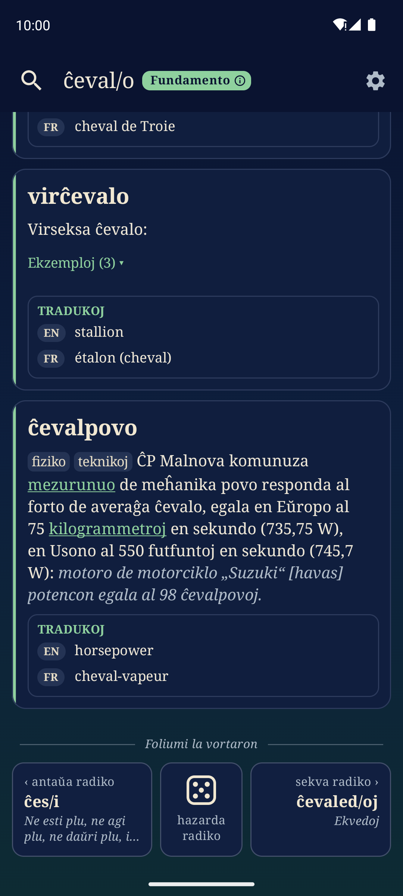

<p align="center">
  
</p>

<h1 align="center">Bona vortaro</h1>

<p align="center">
  <i>Vortaro de Esperanto por Android, sen interreto</i><br>
  <i>An offline Esperanto dictionary for Android</i>
</p>

<p align="center">
  <a href="#esperanto">Esperanto</a> · <a href="#english">English</a>
</p>

<p align="center">
  
  
  
</p>
<p align="center">
  
  
  
</p>

---

## Esperanto

**Bona vortaro** estas vortaro de Esperanto por Android. Ĝi enhavas la tutan
[Retan Vortaron](https://reta-vortaro.de/) (ReVo), la liberan vortaron de
Esperanto, kun ĝiaj tradukoj en pli ol 170 lingvojn. Ĉio estas en la telefono:
ĝi funkcias sen interreto.

### Kion ĝi faras

- **Serĉi** en Esperanto kaj en viaj aliaj lingvoj, kun aŭ sen supersignoj
  (*cevalo* aŭ *cxevalo* trovas *ĉevalo*), kaj per ĵokeroj: *\*ologio* trovas
  ĉiujn vortojn, kiuj finiĝas per „ologio“, kaj *?rbo* trovas *arbo* kaj *urbo*.
- **Legi** klarajn artikolojn: difinoj, ekzemploj, rimarkoj, ligiloj inter la
  vortoj, kaj la tradukoj en la lingvoj, kiujn vi elektas, en via ordo.
- **Scii, kiuj vortoj estas oficialaj**: la etikedoj „Fundamento“ kaj
  „9a Oficiala Aldono“ klarigas sin per unu tuŝo, kaj la listo de ĉiu Aldono
  estas foliumebla.
- **Teni vorton premita** por trovi ĝin en la vortaro, kiel ajn ĝi estas
  skribita: *arbojn* trovas *arbo*, *nomatajn* trovas *nomi*.
- **Foliumi la vortaron** de radiko al radiko, kiel presitan vortaron, aŭ
  malkovri hazardan radikon.
- La **lastaj serĉoj**, tagaj kaj noktaj koloroj („papero“ kaj „stelnokto“), la
  grandeco de la teksto, kaj gvidilo en la agordoj.

### Kial „Bona vortaro“?

La nomo omaĝas al [*La bona lingvo*](http://claudepiron.free.fr/livres/bonalingvo.htm)
de Claude Piron. En ĝi li montras, ke Esperanto estas plej klara kaj plej bela,
kiam oni uzas ĝiajn simplajn radikojn kaj ĝian riĉan vortfaradon. Bona vortaro
volas esti same: simpla, klara, kaj agrabla por uzi.

### Deveno

Bona vortaro baziĝas sur [PReVo](https://github.com/bpeel/prevo) de Neil Roberts,
kies historio estas konservita en ĉi tiu deponejo. Ĝi havas novan interfacon
(Jetpack Compose), novan aspekton kaj novajn funkciojn. La datumoj venas de la
redaktoroj de [Reta Vortaro](https://github.com/revuloj/revo-fonto).

La ilo, kiu konvertas Retan Vortaron por la apo, [prevodb](https://github.com/bpeel/prevodb),
ankaŭ de Neil Roberts, troviĝas en `prevodb/`, kun sia historio.

### Konstrui la apon

La deponejo ne enhavas la datumojn de la vortaro: la konstruado kreas ilin el la
fontoj de Reta Vortaro (en `extern/`), per prevodb. Necesas:

- la Android SDK kaj JDK 17 aŭ pli nova (ekzemple tiu de Android Studio);
- C-kompililo, autoconf, automake, libtool, gettext, pkg-config, glib kaj expat.
  - Debian/Ubuntu: `sudo apt install build-essential autoconf automake libtool gettext autopoint pkg-config libglib2.0-dev libexpat1-dev`
  - macOS (Homebrew): `brew install autoconf automake libtool gettext pkgconf glib expat`,
    kaj `export PKG_CONFIG_PATH=$(brew --prefix expat)/lib/pkgconfig`

```bash
git clone --recursive https://github.com/kotchwane/bona-vortaro.git
cd bona-vortaro
./gradlew assembleDebug        # app/build/outputs/apk/debug/
./gradlew testDebugUnitTest    # la testoj
```

La unua konstruado daŭras kelkajn minutojn: ĝi kompilas prevodb kaj konvertas la
tutan vortaron.

| Dosierujo | Enhavo |
|---|---|
| `app/` | la apo por Android (Kotlin kaj Compose, kun Java-kerno el PReVo) |
| `prevodb/` | la konvertilo de la XML de ReVo al la dosieroj de la apo (C) |
| `extern/revo-fonto`, `extern/voko-grundo` | la fontoj de Reta Vortaro (submoduloj) |
| `scripts/` | la konstruado de la vortaro, la piktogramo |
| `fastlane/` | la tekstoj kaj ekrankopioj por la vendejoj |

### Permesilo

Bona vortaro estas libera programaro, laŭ la GNU General Public License,
versio 2 (vidu [`COPYING`](COPYING)), kiel PReVo.

---

## English

**Bona vortaro** ("good dictionary") is an Esperanto dictionary for Android.
It contains the whole [Reta Vortaro](https://reta-vortaro.de/) (ReVo), the free
Esperanto dictionary, with its translations into more than 170 languages.
Everything is on the phone: it works without Internet access.

### What it does

- **Search** in Esperanto and in your other languages, with or without accents
  (*cevalo* or *cxevalo* finds *ĉevalo*), and with wildcards: *\*ologio* finds
  every word ending in "ologio", and *?rbo* finds *arbo* and *urbo*.
- **Read** clear articles: definitions, examples, remarks, links between words,
  and the translations in the languages you choose, in your order.
- **Know which words are official**: the "Fundamento" and "9a Oficiala Aldono"
  badges explain themselves with a tap, and the list of each Official Addition
  can be browsed.
- **Long-press a word** to look it up, whatever its form: *arbojn* finds *arbo*,
  *nomatajn* finds *nomi*.
- **Leaf through the dictionary** from root to root, like a printed one, or
  discover a random root.
- **Recent searches**, day and night colours ("papero" and "stelnokto"), text
  size, and a guide in the settings.

The interface is in Esperanto.

### Why "Bona vortaro"?

The name is a tribute to [*La bona lingvo*](http://claudepiron.free.fr/livres/bonalingvo.htm)
("The good language") by Claude Piron, who shows that Esperanto is at its
clearest and most beautiful when it uses its simple roots and its rich word
building. Bona vortaro aims to be the same: simple, clear, and pleasant to use.

### Origins

Bona vortaro is based on [PReVo](https://github.com/bpeel/prevo) by Neil Roberts,
whose history is kept in this repository. It has a new interface (Jetpack
Compose), a new look and new features. The data comes from the editors of
[Reta Vortaro](https://github.com/revuloj/revo-fonto).

The tool that converts Reta Vortaro for the app, [prevodb](https://github.com/bpeel/prevodb),
also by Neil Roberts, lives in `prevodb/`, with its history.

### Building

The repository doesn't contain the dictionary data: the build generates it from
the sources of Reta Vortaro (in `extern/`), with prevodb. You need:

- the Android SDK and JDK 17 or newer (for example the one of Android Studio);
- a C compiler, autoconf, automake, libtool, gettext, pkg-config, glib and expat.
  - Debian/Ubuntu: `sudo apt install build-essential autoconf automake libtool gettext autopoint pkg-config libglib2.0-dev libexpat1-dev`
  - macOS (Homebrew): `brew install autoconf automake libtool gettext pkgconf glib expat`,
    and `export PKG_CONFIG_PATH=$(brew --prefix expat)/lib/pkgconfig`

```bash
git clone --recursive https://github.com/kotchwane/bona-vortaro.git
cd bona-vortaro
./gradlew assembleDebug        # app/build/outputs/apk/debug/
./gradlew testDebugUnitTest    # the tests
```

The first build takes a few minutes: it compiles prevodb and converts the whole
dictionary.

| Folder | What it holds |
|---|---|
| `app/` | the Android app (Kotlin and Compose, with a Java core from PReVo) |
| `prevodb/` | the converter from ReVo's XML to the app's files (C) |
| `extern/revo-fonto`, `extern/voko-grundo` | the sources of Reta Vortaro (submodules) |
| `scripts/` | the dictionary build, the icon |
| `fastlane/` | the store texts and screenshots |

### License

Bona vortaro is free software under the GNU General Public License, version 2
(see [`COPYING`](COPYING)), like PReVo.
